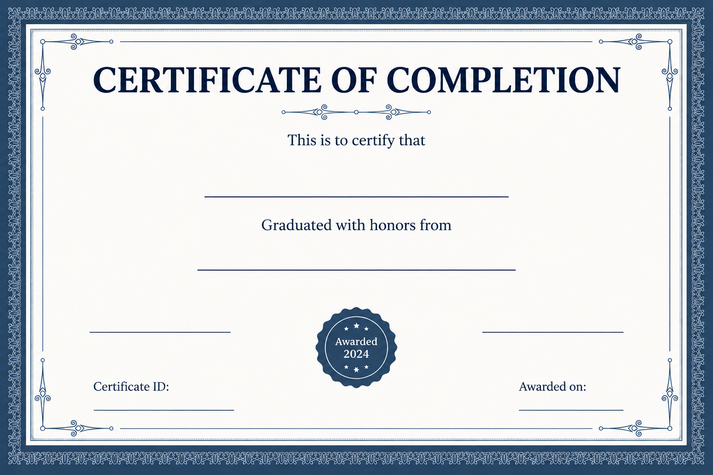

<div align="center">

# Certificate Mail Merge

### Generate presentation-ready certificates from spreadsheet data in minutes.

[](https://www.python.org/)
[](https://streamlit.io/)
[](https://pymupdf.readthedocs.io/)
[](#testing)

Upload one student workbook and one certificate template. The app detects the data columns, fills each certificate, validates the output, and makes the PDFs available individually or as a ZIP download.

[Quick Start](#quick-start) | [Input Format](#input-format) | [Testing](#testing)

</div>

## Preview



The included template demonstrates the supported completion-certificate layout: recipient name, institution, certificate ID, award date, and two calligraphic signature fields.

## Highlights

- **One-click batch generation:** create a certificate for every valid workbook row.
- **Flexible column detection:** recognizes common registration, name, institution, and date header variations.
- **Template-friendly output:** works with PDF, PNG, JPG, and JPEG templates.
- **Professional typography:** adapts long names to the available space and uses calligraphic signatures when a suitable font is installed.
- **Built-in quality control:** validates generated PDFs before marking them successful.
- **Ready-to-download results:** download individual certificates, a ZIP archive, and a CSV generation report.

## How it works

```text
Student workbook + certificate template
		  |
		  v
	Detect columns and read records
		  |
		  v
       Place, resize, and style each field
		  |
		  v
	  Validate and package PDFs
		  |
		  v
	Individual files + ZIP + report
```

## Input Format

Use an `.xlsx` or `.xls` workbook with these columns:

| Column | Example |
| --- | --- |
| `Reg No` | `2026002` |
| `Name` | `Priya Sharma` |
| `Graduated with honors from` | `Vignan University` |
| `Awarded on` | `17-09-2026` |

The parser also recognizes alternatives such as `Registration Number`, `Registration No`, `Student Name`, `University`, `College`, `Institute`, `Award Date`, and `Awarded Date`.

Dates are normalized to `DD-MM-YYYY`. Generated files use the pattern `REG_NO_Name.pdf`, such as `2026002_Priya_Sharma.pdf`.

## Quick Start

```bash
git clone https://github.com/ksumanasri/mailmerg.git
cd mailmerg
python -m venv .venv
```

Activate the environment:

```powershell
.venv\Scripts\Activate.ps1
```

Install dependencies and launch the application:

```bash
pip install -r requirements.txt
streamlit run app.py
```

Then:

1. Upload the student workbook.
2. Upload a `.pdf`, `.png`, `.jpg`, or `.jpeg` template.
3. Review the detected records.
4. Generate and download the certificates.

## Testing

Run the self-contained test suite from the project root:

```bash
python -m unittest discover -s tests -v
```

The tests cover Excel field mapping, date normalization, PDF generation, required output text, signature rendering, and font fallback behavior.

## Project Structure

```text
app.py                              Streamlit application
certificate_agent/main.py           Command-line generation workflow
certificate_agent/tools/            Excel, template, PDF, and report utilities
Certificate.png                     Public sample template
tests/                              Automated generation tests
requirements.txt                    Python dependencies
packages.txt                        System packages for deployment
```

## Deployment

The app can be deployed on Streamlit Community Cloud:

1. Push the repository to GitHub.
2. Create a new Streamlit app from the repository.
3. Select `app.py` as the main file.
4. Deploy with `requirements.txt` and `packages.txt` available at the repository root.

## Technical Notes

- **Interface:** Streamlit
- **Spreadsheet parsing:** pandas and openpyxl
- **PDF generation and validation:** PyMuPDF
- **Font behavior:** bundled Georgia for certificate text; installed calligraphic font when available; built-in italic fallback otherwise
- **Output:** validated PDFs plus a CSV generation report

## Privacy

Student workbooks and generated certificates may contain personal information. Do not commit them to GitHub. The repository ignores Excel data, generated PDFs, rendered previews, and temporary verification folders. Only the public sample template is included for demonstration.

## Contributing

Keep changes focused, run the test suite before opening a pull request, and avoid committing private student data or generated output files.
